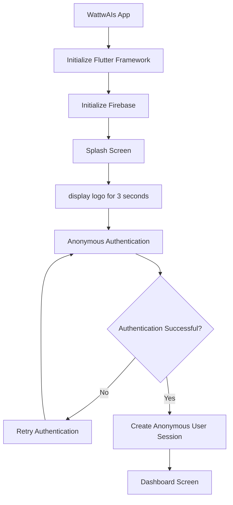

```mermaid
flowchart TD

    A[WattwAIs App]
    --> B[Initialize Flutter Framework]

    B --> C[Initialize Firebase]

    C --> D[Splash Screen]

    D --> E[display logo for 3 seconds]

    E --> F[Anonymous Authentication]

    F --> G{Authentication Successful?}

    G -- No --> H[Retry Authentication]

    H --> F

    G -- Yes --> I[Create Anonymous User Session]

    I --> J[Dashboard Screen]

```