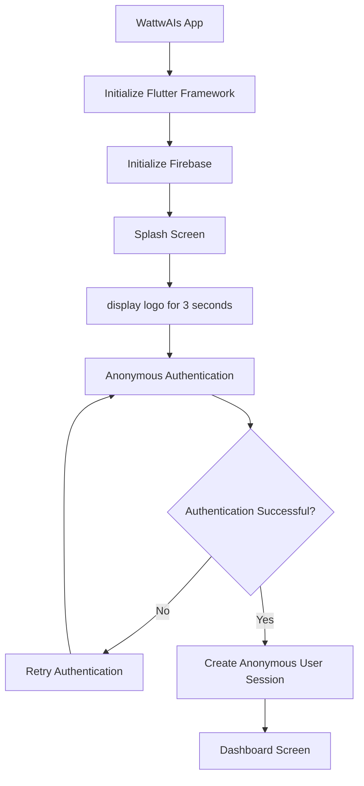
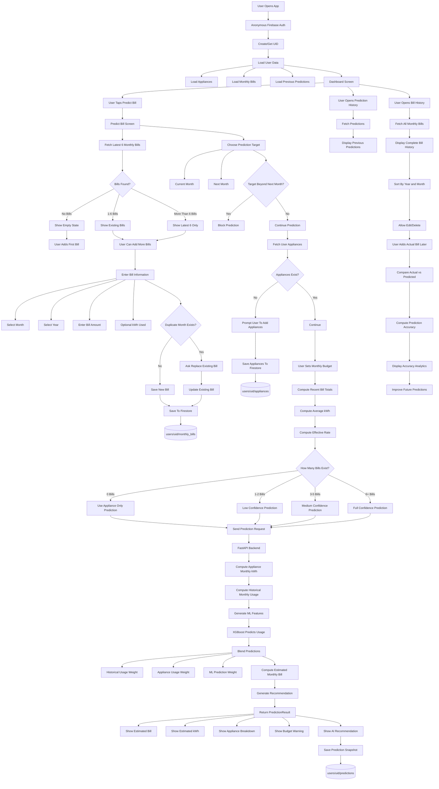

```mermaid
flowchart TD

    A[WattwAIs App]
    --> B[Initialize Flutter Framework]

    B --> C[Initialize Firebase]

    C --> D[Splash Screen]

    D --> E[display logo for 3 seconds]

    E --> F[Anonymous Authentication]

    F --> G{Authentication Successful?}

    G -- No --> H[Retry Authentication]

    H --> F

    G -- Yes --> I[Create Anonymous User Session]

    I --> J[Dashboard Screen]

```

# Flow

```mermaid
flowchart TD

%% =========================
%% APP START
%% =========================

A[User Opens App]

A --> B[Anonymous Firebase Auth]
B --> C[Create/Get UID]

C --> D[Load User Data]
D --> D1[Load Appliances]
D --> D2[Load Monthly Bills]
D --> D3[Load Previous Predictions]

%% =========================
%% DASHBOARD
%% =========================

D --> E[Dashboard Screen]

E --> F[User Taps Predict Bill]

%% =========================
%% PREDICT BILL SCREEN
%% =========================

F --> G[Predict Bill Screen]

G --> H[Fetch Latest 6 Monthly Bills]

H --> I{Bills Found?}

I -->|No Bills| J[Show Empty State]
I -->|1-6 Bills| K[Show Existing Bills]
I -->|More Than 6 Bills| L[Show Latest 6 Only]

J --> M[User Adds First Bill]
K --> N[User Can Add More Bills]
L --> N

%% =========================
%% BILL ENTRY
%% =========================

N --> O[Enter Bill Information]

O --> O1[Select Month]
O --> O2[Select Year]
O --> O3[Enter Bill Amount]
O --> O4[Optional kWh Used]

O --> P{Duplicate Month Exists?}

P -->|Yes| Q[Ask Replace Existing Bill]
P -->|No| R[Save New Bill]

Q --> S[Update Existing Bill]

R --> T[Save To Firestore]
S --> T

%% =========================
%% FIRESTORE
%% =========================

T --> U[(users/uid/monthly_bills)]

%% =========================
%% PREDICTION TARGET
%% =========================

G --> V[Choose Prediction Target]

V --> V1[Current Month]
V --> V2[Next Month]

%% =========================
%% INVALID FUTURE PREDICTIONS
%% =========================

V --> W{Target Beyond Next Month?}

W -->|Yes| X[Block Prediction]
W -->|No| Y[Continue Prediction]

%% =========================
%% APPLIANCES
%% =========================

Y --> Z[Fetch User Appliances]

Z --> AA{Appliances Exist?}

AA -->|No| AB[Prompt User To Add Appliances]
AA -->|Yes| AC[Continue]

AB --> AD[Save Appliances To Firestore]

AD --> AE[(users/uid/appliances)]

%% =========================
%% BUDGET INPUT
%% =========================

AC --> AF[User Sets Monthly Budget]

%% =========================
%% PREPARE PREDICTION
%% =========================

AF --> AG[Compute Recent Bill Totals]
AG --> AH[Compute Average kWh]
AH --> AI[Compute Effective Rate]

%% =========================
%% EDGE CASES
%% =========================

AI --> AJ{How Many Bills Exist?}

AJ -->|0 Bills| AK[Use Appliance Only Prediction]
AJ -->|1-2 Bills| AL[Low Confidence Prediction]
AJ -->|3-5 Bills| AM[Medium Confidence Prediction]
AJ -->|6+ Bills| AN[Full Confidence Prediction]

%% =========================
%% BACKEND REQUEST
%% =========================

AK --> AO[Send Prediction Request]
AL --> AO
AM --> AO
AN --> AO

%% =========================
%% FASTAPI BACKEND
%% =========================

AO --> AP[FastAPI Backend]

AP --> AQ[Compute Appliance Monthly kWh]

AQ --> AR[Compute Historical Monthly Usage]

AR --> AS[Generate ML Features]

AS --> AT[XGBoost Predicts Usage]

AT --> AU[Blend Predictions]

AU --> AU1[Historical Usage Weight]
AU --> AU2[Appliance Usage Weight]
AU --> AU3[ML Prediction Weight]

%% =========================
%% FINAL COMPUTATION
%% =========================

AU --> AV[Compute Estimated Monthly Bill]

AV --> AW[Generate Recommendation]

%% =========================
%% RETURN RESULT
%% =========================

AW --> AX[Return PredictionResult]

%% =========================
%% DISPLAY RESULT
%% =========================

AX --> AY[Show Estimated Bill]
AX --> AZ[Show Estimated kWh]
AX --> BA[Show Appliance Breakdown]
AX --> BB[Show Budget Warning]
AX --> BC[Show AI Recommendation]

%% =========================
%% SAVE PREDICTION HISTORY
%% =========================

BC --> BD[Save Prediction Snapshot]

BD --> BE[(users/uid/predictions)]

%% =========================
%% PREDICTION HISTORY
%% =========================

E --> BF[User Opens Prediction History]

BF --> BG[Fetch Predictions]

BG --> BH[Display Previous Predictions]

%% =========================
%% BILL HISTORY
%% =========================

E --> BI[User Opens Bill History]

BI --> BJ[Fetch All Monthly Bills]

BJ --> BK[Display Complete Bill History]

BK --> BL[Sort By Year and Month]

BL --> BM[Allow Edit/Delete]

%% =========================
%% FUTURE ACTUAL BILL COMPARISON
%% =========================

BM --> BN[User Adds Actual Bill Later]

BN --> BO[Compare Actual vs Predicted]

BO --> BP[Compute Prediction Accuracy]

BP --> BQ[Display Accuracy Analytics]

%% =========================
%% OPTIONAL FUTURE AI LOOP
%% =========================

BQ --> BR[Improve Future Predictions]
```

```mermaid
flowchart TD

%% =====================================
%% START PREDICTION FLOW
%% =====================================

A[User Opens Predict Bill Screen]

%% =====================================
%% LOAD RECENT BILL HISTORY
%% =====================================

A --> B[Fetch Latest 6 Bills From Firestore]

B --> C{Bills Found?}

C -->|0 Bills| D[Show Empty Bill State]
C -->|1-6 Bills| E[Display Available Bills]
C -->|More Than 6 Bills| F[Display Latest 6 Bills Only]

%% =====================================
%% EMPTY STATE
%% =====================================

D --> G[Prompt User To Add Bill]

%% =====================================
%% ADD BILL FLOW
%% =====================================

G --> H[Open Add Bill Form]
E --> H
F --> H

H --> I[User Selects Month]
I --> J[User Selects Year]

J --> K[User Enters Bill Amount]

K --> L[Optional User Enters kWh Used]

%% =====================================
%% VALIDATION
%% =====================================

L --> M{Valid Inputs?}

M -->|No| N[Show Validation Error]

N --> H

M -->|Yes| O[Check Duplicate Month-Year]

%% =====================================
%% DUPLICATE BILL CHECK
%% =====================================

O --> P{Bill Already Exists?}

P -->|Yes| Q[Ask User Replace Existing Bill]

Q -->|Replace| R[Update Existing Bill]

Q -->|Cancel| S[Return To Form]

P -->|No| T[Create New Bill]

%% =====================================
%% SAVE BILL
%% =====================================

R --> U[Save Bill To Firestore]
T --> U

U --> V[(users/uid/monthly_bills)]

%% =====================================
%% REFRESH LATEST BILLS
%% =====================================

V --> W[Refresh Latest 6 Bills]

%% =====================================
%% PREDICTION TARGET
%% =====================================

W --> X[User Chooses Prediction Target]

X --> X1[Current Month]
X --> X2[Next Month]

%% =====================================
%% INVALID TARGETS
%% =====================================

X --> Y{Target Beyond Next Month?}

Y -->|Yes| Z[Block Prediction]

Z --> ZA[Show Unsupported Prediction Message]

Y -->|No| AB[Continue Prediction]

%% =====================================
%% LOAD APPLIANCES
%% =====================================

AB --> AC[Fetch Appliances From Firestore]

AC --> AD{Appliances Exist?}

AD -->|No| AE[Show Add Appliance Prompt]

AE --> AF[User Adds Appliances]

AF --> AG[Save Appliances]

AG --> AH[(users/uid/appliances)]

AD -->|Yes| AI[Continue]

AH --> AI

%% =====================================
%% MONTHLY BUDGET
%% =====================================

AI --> AJ[User Inputs Monthly Budget]

%% =====================================
%% PREPARE BILL DATA
%% =====================================

AJ --> AK[Compute Total Historical Bills]

AK --> AL[Compute Total Historical kWh]

%% =====================================
%% HANDLE MISSING KWH
%% =====================================

AL --> AM{Missing kWh Values?}

AM -->|Yes| AN[Estimate kWh Using Rate]

AM -->|No| AO[Use Actual kWh]

%% =====================================
%% COMPUTE EFFECTIVE RATE
%% =====================================

AN --> AP[Compute Effective Rate]
AO --> AP

%% =====================================
%% DETERMINE CONFIDENCE
%% =====================================

AP --> AQ[Count Available Bill Months]

AQ --> AR{Bill Count}

AR -->|0 Bills| AS[Use Appliance Only Prediction]

AR -->|1-2 Bills| AT[Low Confidence Prediction]

AR -->|3-5 Bills| AU[Medium Confidence Prediction]

AR -->|6+ Bills| AV[Full Confidence Prediction]

%% =====================================
%% PREPARE BACKEND PAYLOAD
%% =====================================

AS --> AW[Build Prediction Request]
AT --> AW
AU --> AW
AV --> AW

%% =====================================
%% SEND TO BACKEND
%% =====================================

AW --> AX[Send Request To FastAPI Backend]

%% =====================================
%% BACKEND COMPUTATION
%% =====================================

AX --> AY[Compute Appliance Monthly Usage]

AY --> AZ[Compute Historical Usage Average]

AZ --> BA[Generate ML Features]

%% =====================================
%% MACHINE LEARNING
%% =====================================

BA --> BB[XGBoost Predicts Usage]

%% =====================================
%% BLENDING
%% =====================================

BB --> BC[Blend Historical Appliance and ML Estimates]

BC --> BD[Apply Weighted Averaging]

BD --> BE[Compute Estimated Monthly kWh]

%% =====================================
%% BILL COMPUTATION
%% =====================================

BE --> BF[Compute Estimated Bill]

BF --> BG[Check Budget Threshold]

%% =====================================
%% BUDGET WARNING
%% =====================================

BG --> BH{Exceeds Budget?}

BH -->|Yes| BI[Generate Warning]

BH -->|No| BJ[Generate Normal Recommendation]

%% =====================================
%% BUILD RESPONSE
%% =====================================

BI --> BK[Build PredictionResult]
BJ --> BK

%% =====================================
%% RETURN RESPONSE
%% =====================================

BK --> BL[Return Prediction Response]

%% =====================================
%% DISPLAY RESULTS
%% =====================================

BL --> BM[Display Predicted Bill]

BM --> BN[Display Estimated kWh]

BN --> BO[Display Appliance Breakdown]

BO --> BP[Display Confidence Level]

BP --> BQ[Display Recommendation]

BQ --> BR[Display Budget Warning]

%% =====================================
%% SAVE PREDICTION HISTORY
%% =====================================

BR --> BS[Save Prediction Snapshot]

BS --> BT[(users/uid/predictions)]

%% =====================================
%% FUTURE COMPARISON
%% =====================================

BT --> BU[Future Actual Bill Can Be Compared]

BU --> BV[Compute Prediction Accuracy]

BV --> BW[Improve Future Predictions]
```