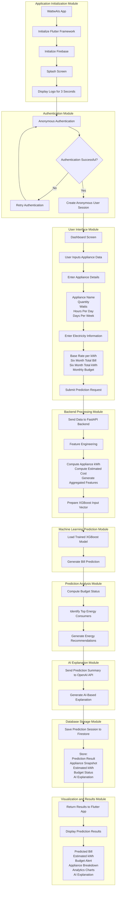

```mermaid
flowchart TD

    %% =====================================
    %% APPLICATION INITIALIZATION MODULE
    %% =====================================

    subgraph A1[Application Initialization Module]
        A[WattwAIs App] --> B[Initialize Flutter Framework]
        B --> C[Initialize Firebase]
        C --> D[Splash Screen]
        D --> E[Display Logo for 3 Seconds]
    end

    %% =====================================
    %% AUTHENTICATION MODULE
    %% =====================================

    subgraph A2[Authentication Module]
        E --> F[Anonymous Authentication]
        F --> G{Authentication Successful?}
        G -- No --> H[Retry Authentication]
        H --> F
        G -- Yes --> I[Create Anonymous User Session]
    end

    %% =====================================
    %% USER INTERFACE MODULE
    %% =====================================

    subgraph A3[User Interface Module]
        I --> J[Dashboard Screen]
        J --> K[User Inputs Appliance Data]
        K --> L[Enter Appliance Details]
        L --> M[
            Appliance Name
            Quantity
            Watts
            Hours Per Day
            Days Per Week
        ]
        M --> N[Enter Electricity Information]
        N --> O[
            Base Rate per kWh
            Six Month Total Bill
            Six Month Total kWh
            Monthly Budget
        ]
        O --> P[Submit Prediction Request]
    end

    %% =====================================
    %% BACKEND PROCESSING MODULE
    %% =====================================

    subgraph A4[Backend Processing Module]
        P --> Q[Send Data to FastAPI Backend]
        Q --> R[Feature Engineering]
        R --> S[
            Compute Appliance kWh
            Compute Estimated Cost
            Generate Aggregated Features
        ]
        S --> T[Prepare XGBoost Input Vector]
    end

    %% =====================================
    %% MACHINE LEARNING MODULE
    %% =====================================

    subgraph A5[Machine Learning Prediction Module]
        T --> U[Load Trained XGBoost Model]
        U --> V[Generate Bill Prediction]
    end

    %% =====================================
    %% POST-PROCESSING MODULE
    %% =====================================

    subgraph A6[Prediction Analysis Module]
        V --> W[Compute Budget Status]
        W --> X[Identify Top Energy Consumers]
        X --> Y[Generate Energy Recommendations]
    end

    %% =====================================
    %% AI EXPLANATION MODULE
    %% =====================================

    subgraph A7[AI Explanation Module]
        Y --> Z[Send Prediction Summary to OpenAI API]
        Z --> AA[Generate AI-Based Explanation]
    end

    %% =====================================
    %% DATABASE MODULE
    %% =====================================

    subgraph A8[Database Storage Module]
        AA --> AB[Save Prediction Session to Firestore]
        AB --> AC[
            Store:
            Prediction Result
            Appliance Snapshot
            Estimated kWh
            Budget Status
            AI Explanation
        ]
    end

    %% =====================================
    %% VISUALIZATION MODULE
    %% =====================================

    subgraph A9[Visualization and Results Module]
        AC --> AD[Return Results to Flutter App]
        AD --> AE[Display Prediction Results]
        AE --> AF[
            Predicted Bill
            Estimated kWh
            Budget Alert
            Appliance Breakdown
            Analytics Charts
            AI Explanation
        ]
    end
    %% =====================================

```
